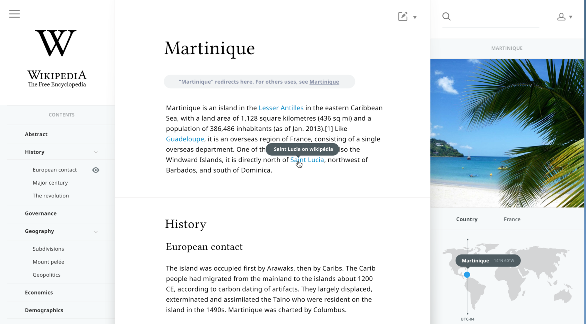

## Screw bootstrap!

Wow, screw bootstrap! But why? Well, it maybe sounds worse than it is. Fortunately, it is my biggest advice for beginner Frontend Developers.

If you can't develop layouts without the bootstrap framework (or other CSS framework), ask yourself, do you know CSS? If no, than this is the perfect post for you!

This is your next step to grow in your skillset, to be a better Frontend Developer.

To be clear, the bootstrap framework source is not bad! Not at all, in some cases, it became really handy. It gives the ability to build layout's faster, but if you don't know CSS, it will become a mess. Not a small mess, but a big mess!

Beside that, the most CSS frameworks are just so big, and you even don't use all theses bytes. It is even worse for the user, most of the sites build with Bootstrap, looks the same, that's kind of sad!

## Grow your CSS skills

How to grow your CSS skills is not difficult! First, you already know, avoid any CSS framework. Second, practice a lot with building complex layouts (with a lot, I mean A LOT :-) ). Try different techniques to achieve the same thing. I would love to help you, so I've listed 2 cool exercises.

### Exercises

Build a slick design from dribbble, there are loads of it, so why not use them to train your CSS skills.

#### 1\. Oculus Redesign (Components, Clear architecture, CSS naming convention)

**Components**
With this design you can train yourself, looking to building blocks. Separate the layout in small, easy-to-build components. Keep in mind what kind of selectors you're gonna use and how to name your classes.

**Clear Architecture**
Your CSS has a good architecture when someone else looks into your code and understands what you were building before he sees the design or checked the website in the browser.

**CSS Naming Convention**
I want to introduce to you "CSS naming conventions", these are methods to give a good structure to your CSS and naming your classes. My favorite is BEM, but I you have to pick the one that sounds natural for you. So check out [BEM](http://getbem.com/introduction/), [OOCSS](http://oocss.org) & [SMACSS](https://smacss.com), and pick the one you love.

**Reading list:**The list below, give you more information about the CSS naming conventions, the show you more how to use it.

* [MindBEMding – getting your head ’round BEM syntax](http://csswizardry.com/2013/01/mindbemding-getting-your-head-round-bem-syntax/)
* [An Introduction To Object Oriented CSS (OOCSS)](https://www.smashingmagazine.com/2011/12/an-introduction-to-object-oriented-css-oocss/)
* [OOCSS, ACSS, BEM, SMACSS: what are they? What should I use?](http://clubmate.fi/oocss-acss-bem-smacss-what-are-they-what-should-i-use/)

Please let me know in the comments, which one you like!

#### 2\. Wikipedia Concept (Icons, Multi-level navigation, Flexible Grid)

**Icons**First of all, I love the simplicity of this design. There are a few nice icons in this design. You can add them in so many ways: Just an image, SVG, background-image, background image sprite and a font-icon. If you normally use the image, then now try a whole different way like the  sprite. Or if you are used to the font icon, then now explore the SVG in HTML.

There are so many ways with HTML & CSS to achieve the same. But sometimes you need to explore new ways, that make you grow in your skillset!

**Multi-level navigation**In this design is a nice vertical multi-level navigation. I see a lot of beginners that don't stick to just only an unordered list, but the mix it up with some divs or spans. Or the even don't build it them self and use a jQuery plugin.

Let's do your best to use only an unordered list with li's inside of it, to build a multi-level navigation. And to challenge yourself, even more, add some extra level to it. Or try out a horizontal navigation.

**Flexible grid**This design is built on top of a multi-column grid. If you are used to Bootstrap or an other CSS framework you know directly what I mean. But since we are not gonna use any CSS framework, we are gonna build one yourself. Think about a 12 column grid or a 9 column grid (what you like the most), create with different classes a grid. But make it flexible, take into account that it should also work on mobile devices. So leaf fixed sizes like pixels but use percentage instead.

### How to do the exercises?

If you want help or guidance from us or someone you know, make it easy for them to help you. So use Github, for instance, to set your code, so someone else can easily check it out. But I prefer [Codepen](http://codepen.io) or [JSfiddle](https://jsfiddle.net) even more, we can run it directly in the browser, so much faster to help.

If you realy need guidance or help from me or the others in the community, sign in (or register for free) and please let us know. You can also reach us in the comments :-)

I'm really looking forwards to your exercises!

##

## Comments from WordPress

*  **[Nate James Meyers](https://www.facebook.com/app_scoped_user_id/1769038413343426/)** 2016-06-10T17:02:03Z
  > Solid advice with just enough clickbait to get me to read it. Good stuff
*  **[Raymon Schouwenaar](http://www.raymonschouwenaar.nl)** 2016-06-10T17:03:07Z
  > Thanks! Glad you like it!!
* **[Junior Frontend Development weekly link sharing #16 | 神刀安全网](http://www.shellsec.com/news/27421.html)** 2016-06-13T01:18:27Z
  > [&#8230;] Best advice: Screw the Bootstrap CSS Framework!  Wow, screw bootstrap! Why? Well, it maybe sounds worse than it is. Fortunately, it is the best advice for beginner Frontend Developers to learn CSS better. [&#8230;]
