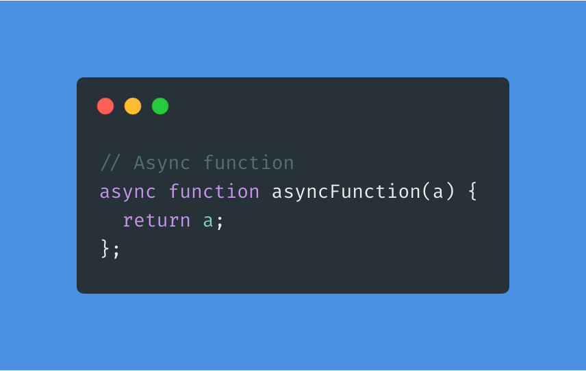

_"Photo by [Pineapple Supply Co](https://unsplash.com/@pineapple?utm_source=medium&utm_medium=referral) on [Unsplash](https://unsplash.com/?utm_source=mrfrontend.org&utm_medium=referral)_

## _Let’s not waste your time, quickly understand async/await in TypeScript_

## Our topic today:

- Async keyword
- Await keyword

## Let’s start with the Async keyword

With the `async` keyword in a TypeScript application we can make **asynchronous functions** like this, by adding it before the `function` keyword:

In the next example, we have two promises returning a string. One after 500ms and the other after 1000ms. Inside the `asyncFunction` we call first `promiseOne` and then `promiseTwo` . The last promise has an advantage of 500ms. So if we would log this `asyncFunction` then the second promise is logged slightly earlier than the first one. Easy is that.

## The Await keyword

With the next way, we can write code that is cleaner and more understandable than [chained promises](https://javascript.info/promise-chaining). We are going to add the `await` keyword in our example. The only thing the `await` keyword is doing is waiting for the promise to resolve before continuing to the next promise. That’s it. Let’s see in our example:

Inside the `asyncAwaitFunction` we call again first the `promiseOne` and then `promiseTwo` . The last promise has again the advantage of 500ms. But now if we log this `asyncAwaitFunction` the `promiseOne` is logged earlier than the `promiseTwo` , because it needs to be resolved before continuing to the next promise.
