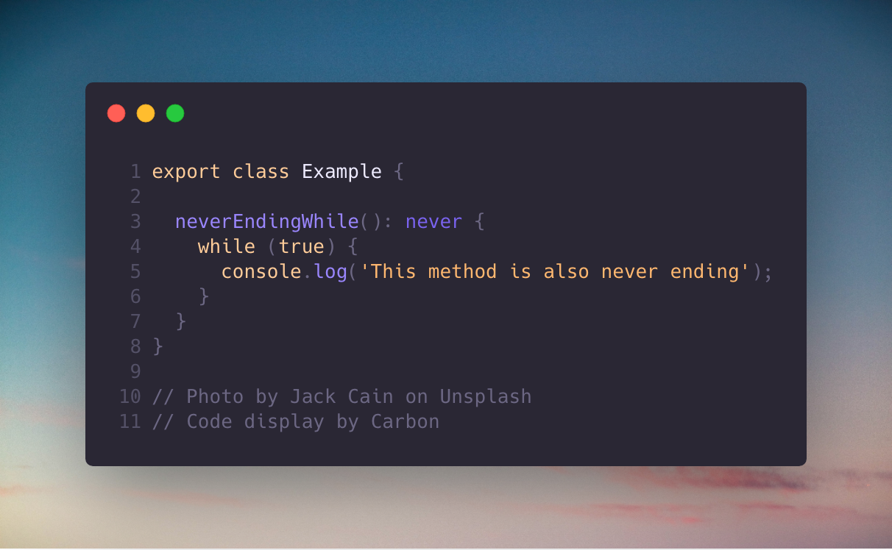

_"Photo by [Max Nelson](https://unsplash.com/@maxcodes?utm_source=medium&utm_medium=referral) on [Unsplash](https://unsplash.com/?utm_source=medium&utm_medium=referral)_

There are two types which are commonly unknown by people who use TypeScript or known but never used… Do you see what I did there? This blog is just a simple explanation about how and when you can use these types.

## The two types are

- unknown
- never

## Prerequisites to use

- TypeScript 3+ for unknown type
- TypeScript 2+ for never type

## The unknown type

The unknown type is commonly used to avoid the any type. Instead of having no type or any type, we assign it to unknown. Everything assigned to this type will result in an error unless you assign it to another type at some point.

So basically we don’t know the type at first but need to assign it to a known type later on. Now you are forced to type check.
Example of the unknown type:

## The never type

With the never type, we can detect unreachable code or check if a function/method did not return anything when it is supposed to. There are three ways to use it;

- A function/method never returns any value while it has a return type
- A function/method will always throw an error
- A function/method assigned to a property with the `never` type

## Examples of the never type:

If we would not pass a string or boolean as a parameter in the `neverEndingMethod` then it would always throw an error.

### The type ‘never’ is not the same as ‘void’

The difference is:

- A function/method that is supposed to return nothing, this can have return type: void. It can also be assigned.
- A function/method that never returns a value while it supposed to return something, or always should throw an error, then it can have return type: never. It can only be assigned to another never.
